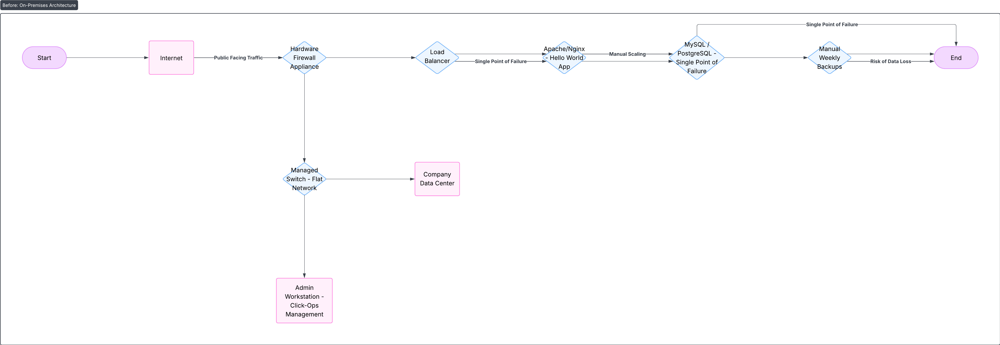
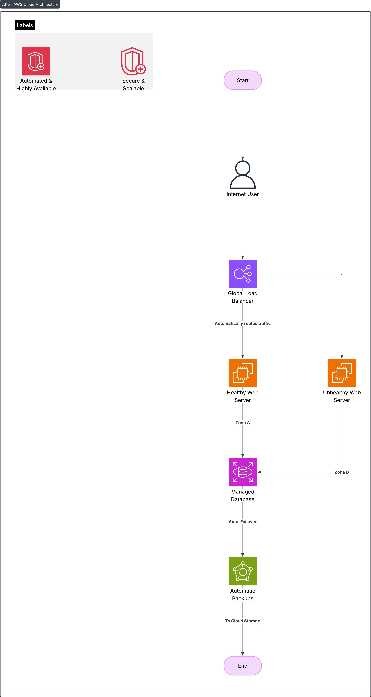

# Hello World Application Cloud Migration Strategy

**Author:** Cameron Cleveland
**Date:** 08/29/2025
**Project:** Hello World Cloud Migration

## Project Overview
This project outlines the migration strategy for a public-facing "Hello World" application from an on-premises data center to the cloud. The client's top priorities are achieving **minimal downtime** during the migration and ensuring a **highly secure** final architecture. This document details the current state, the proposed future state, and the roadmap to get there.

## Current State Analysis

The following diagram illustrates the application's existing on-premises network topology, which is functional but carries significant risk and operational overhead.

### Diagram Explanation & Key Issues:
*   **Single Points of Failure:** The architecture relies on a **single database server** and a **single load balancer**. The failure of either component would cause complete application downtime.
*   **Manual Operational Overhead:** Key processes like **weekly backups** are manual, risking data loss and consuming valuable IT resources. The entire environment is managed via **"Click-Ops,"** leading to slow, inconsistent configurations and deployments.
*   **Lack of Scalability:** The **static web servers** cannot automatically scale to handle increases in traffic. Scaling requires manual provisioning of new hardware or virtual machines, which is a slow process that cannot respond to sudden traffic spikes.
*   **Flat Network Security:** All devices reside on a **flat network** behind a single firewall. This provides no internal segmentation, meaning a breach on one server could easily lead to a compromise of the entire environment.

## Future State Recommendation: AWS Cloud Architecture

The proposed future state leverages Amazon Web Services (AWS) to create a resilient, automated, and secure infrastructure that directly addresses the limitations of the current environment.

### Diagram Explanation & Networking Choices:

This architecture is built on AWS's well-architected framework, focusing on reliability, security, and cost optimization.

**1. Reliability & High Availability:**
*   **Amazon EC2 Auto Scaling Groups:** The application will run on EC2 instances in an Auto Scaling Group, which automatically adds or removes instances based on traffic demand. This ensures performance during peaks and cost savings during troughs.
*   **Multi-AZ Deployment:** All resources will be deployed across multiple **Availability Zones (AZs)** within a single AWS Region. This physically separates infrastructure to protect against failures in a single data center.
*   **Application Load Balancer (ALB):** The ALB automatically distributes incoming traffic across all healthy EC2 instances in multiple AZs, serving as a single, reliable entry point and eliminating the load balancer as a single point of failure.

**2. Security - A Top Priority:**
*   **Web Application Firewall (AWS WAF) & Shield:** These services are deployed in front of the ALB to protect the application from common web exploits (e.g., SQL injection, XSS) and Distributed Denial of Service (DDoS) attacks.
*   **Network Segmentation with VPC:** The infrastructure will be housed within an Amazon **Virtual Private Cloud (VPC)** with public and private subnets. Web servers will be placed in private subnets, isolated from the public internet, with strict security group rules acting as firewalls.
*   **Secure Remote Access with AWS Systems Manager:** Instead of insecure RDP/SSH, administrators will use **Session Manager** for secure, auditable, and port-free access to EC2 instances for management, adhering to the principle of least privilege.

**3. Operational Excellence & Cost Optimization:**
*   **Managed Database with Amazon RDS:** The database will be migrated to **Amazon RDS**, which handles patching, backups, and failure recovery automatically. A Multi-AZ configuration will provide a standby replica for automatic failover, eliminating downtime from database issues.
*   **Automated Backups:** Backups will be fully automated using **AWS Backup** policies, ensuring point-in-time recovery and geographic replication for disaster recovery without manual intervention.

## Recommended Migration Strategy

To achieve minimal downtime, a **lift-and-shift** approach using **AWS Application Migration Service (MGN)** is recommended.

1.  **Replication:** AWS MGN will be installed on the on-premises servers to continuously replicate them into a staging area within AWS.
2.  **Testing:** The replicated servers will be launched in an isolated AWS network for testing and validation without impacting the live production application.
3.  **Cutover:** Once validated, a final incremental sync will be performed. DNS records will then be updated to point the application's domain name to the new AWS Application Load Balancer, completing the migration with minimal downtime.

## Conclusion
This migration transforms a rigid and manually-intensive on-premises operation into a scalable, self-healing, and secure system on AWS. By leveraging managed services, we significantly reduce operational overhead while simultaneously improving performance, security, and reliability, ensuring the "Hello World" application is prepared for future growth.
